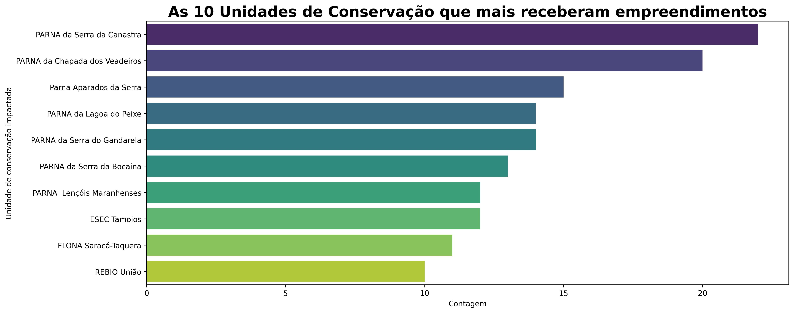
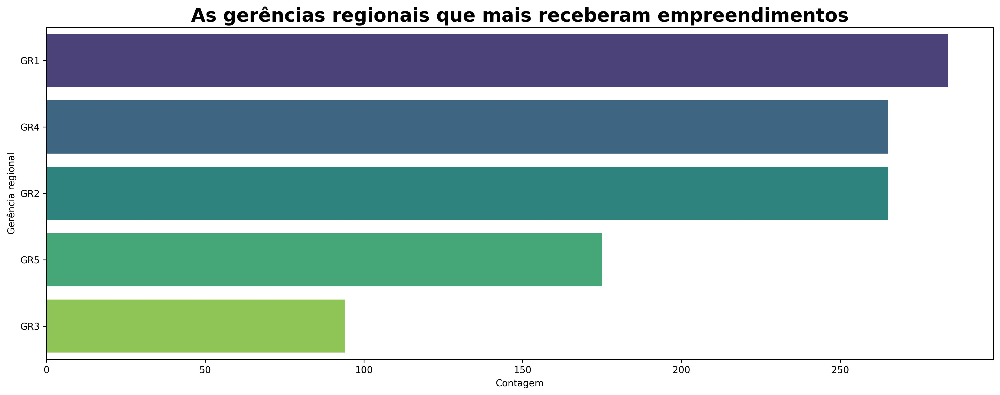
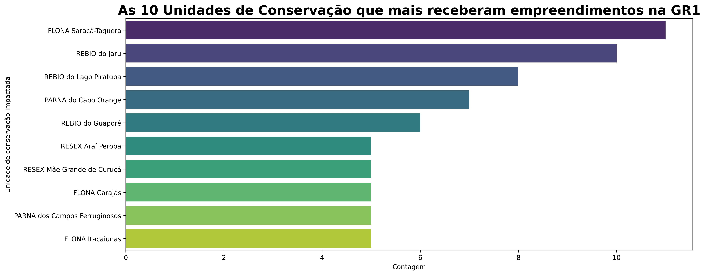
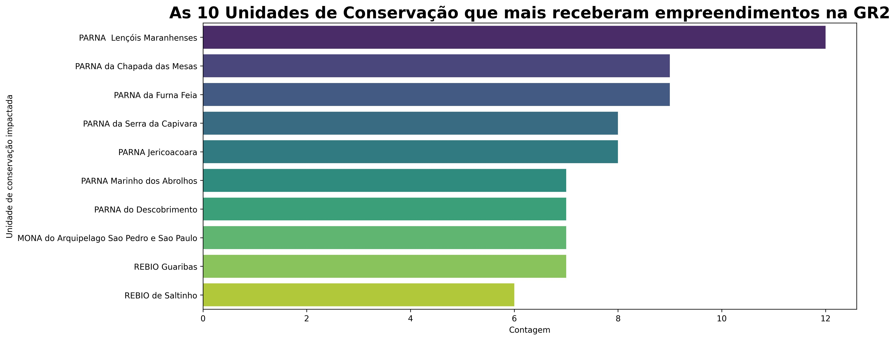
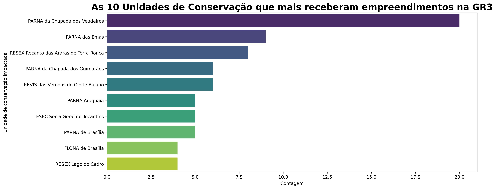
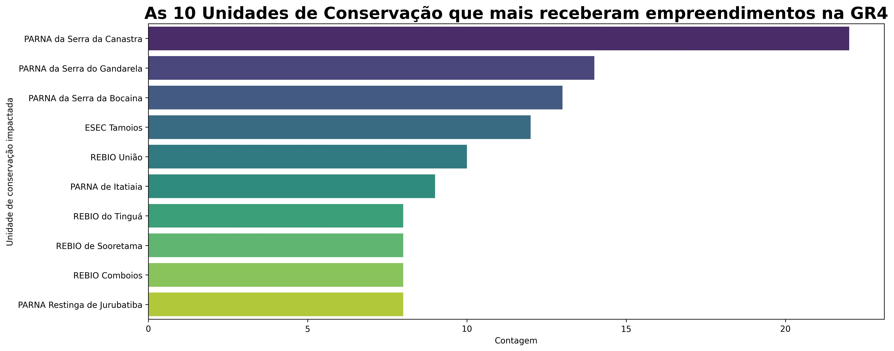
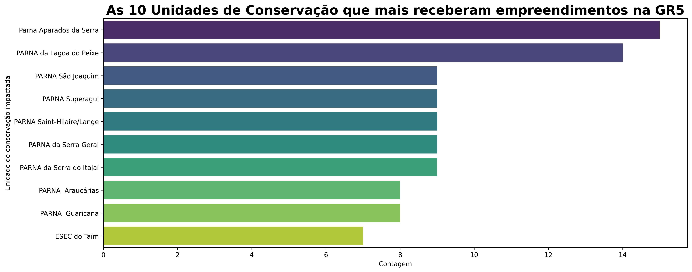

# Os recursos das compensações ambientais das unidades de conservação no Brasil

## Sumário

- [Introdução](https://github.com/fernandessfae/saldo_compensacao_ambiental_ucs_2025?tab=readme-ov-file#introdu%C3%A7%C3%A3o)
- [Obtenção de dados](https://github.com/fernandessfae/saldo_compensacao_ambiental_ucs_2025?tab=readme-ov-file#obten%C3%A7%C3%A3o-dos-dados)
- [Panorama Geral](https://github.com/fernandessfae/saldo_compensacao_ambiental_ucs_2025?tab=readme-ov-file#panorama-geral)
- [Panorama Regional](https://github.com/fernandessfae/saldo_compensacao_ambiental_ucs_2025?tab=readme-ov-file#panorama-regional)
    - [Região Norte](https://github.com/fernandessfae/saldo_compensacao_ambiental_ucs_2025?tab=readme-ov-file#gr1---regi%C3%A3o-norte)
    - [Região Nordeste](https://github.com/fernandessfae/saldo_compensacao_ambiental_ucs_2025?tab=readme-ov-file#gr2---regi%C3%A3o-nordeste)
    - [Região Centro-Oeste](https://github.com/fernandessfae/saldo_compensacao_ambiental_ucs_2025?tab=readme-ov-file#gr3---regi%C3%A3o-centro-oeste)
    - [Região Sudeste](https://github.com/fernandessfae/saldo_compensacao_ambiental_ucs_2025?tab=readme-ov-file#gr4---regi%C3%A3o-sudeste)
    - [Região Sul](https://github.com/fernandessfae/saldo_compensacao_ambiental_ucs_2025?tab=readme-ov-file#gr5---regi%C3%A3o-sul)
- [Conclusão](https://github.com/fernandessfae/saldo_compensacao_ambiental_ucs_2025?tab=readme-ov-file#conclus%C3%A3o)

## Introdução

 Para quem trabalha na área ambiental, ou que tem algum tipo de conhecimento da área, sabe que qualquer coisa que venha a ser feito em determinado ambiente gerará um impacto, desde uma simples corte de uma árvore a construção de algum empreendimento naquele local, assim como a construção de pistas, oleodutos, linhas de transmissão de energia elétrica, etc. Com isso, são necessárias medidas para mitigar, ou reduzir, o impacto ambiental naquele local. Existem várias medidas para redução dos impactos ambientais, mas o foco deste texto serão os <b>recursos de compensação ambiental</b>. 

 

Os recursos de compensação ambiental são mecanismos financeiros ou ações que visam reparar os danos causados ao meio ambiente. São formas de "indenizar", vamos assim dizer, o meio ambiente por impactos negativos dos empreendimentos ou de danos ambientais não planejados. Esse mecanismo está previsto na <b>lei 9.985/2000</b> e regulamentada pelo  <b>decreto 4.340/2002</b>.
 

Os recursos de compensação financeira funcionam da seguinte forma: O empreendedor que causar os danos ambientais deve arcar com os custos de mitigação ou reparação do local onde será executado o empreendimento. A necessidade e o custo de reparação são avaliador pelo orgão ambiental emissor da licença necessária, podendo ser única (licença simplificada) ou necessária em cada etapa do licenciamento. A compensação pode ser financeira ou consistir em ações que promovam a recuperação ou a conservação de áreas degradadas, além de ser um instrumento para fortalecer o <b>Sistema Nacional de Unidades de Conservação (SNUC)</b>.
 

Como deu para perceber, os recursos de compensação ambiental tem a finalidade de servir, em sua grande maioria, as unidades de conservação (UC) presentes em território nacional. Com base nisso, vamos entender como funcionou todo o processo, desde a obtenção dos dados disponíveis até a análise propriamente dita.

## Obtenção dos dados

Para a obtenção dos dados, utilizou-se os dados dos instituto Chico Mendes de biodiversidade (ICMBio) presente no site do dados aberto do governo federal, algo referente ao recurso de compensação financeira, podendo ter acesso clicando <a href='https://dados.gov.br/dados/conjuntos-dados/recursos-de-compensacao-ambiental-para-unidades-de-conservacao-federais'>aqui</a>, assim como os outros dados referente a informação geral dos biomas presentes em cada unidade de conservação (UC), inclusive, já fiz um análise dos dados, de forma detalhada, que pode ter acesso clicando <a href='https://github.com/fernandessfae/dados_ucs_2025'>aqui</a>. De qualquer forma, os dados estarão disponíveis aqui neste repositório. Na questão de manipulação e análise dos dados, utilizou-se a linguagem de programação python com suas bibliotecas específicas e funcionou da seguinte forma: Criou-se um arquivo Excel unindo as duas planilhas através de uma coluna chamada 'Código SNUC', que é uma espécie de 'RG' de cada UC, unindo as informações mais relevantes das duas planilhas, a ponto de gerar uma planilha própria para fazer a análise dos dados propriamente dita. falando em análise, vamos ver os recursos de compensação financeira das unidades de conservação em todo o país.

## Panorama Geral

A partir de agora, vamos analisar os dados da compensação financeira a nível nacional. A nivel de conhecimento, os dados mostram que existem cerca de <b>293</b> UCs registradas, até o momento, podendo haver alterações no futuro. As unidades de conservação podem ser classificadas como:  
<ul>
<li>APA - Área de proteção ambiental</li>
<li>ARIE - Área de relevante interesse ecológico</li>
<li>ESEC - Estação ecológica</li>
<li>FLONA - Floresta nacional</li>
<li>MONA - Monumento natural</li>
<li>PARNA - Parque nacional</li>
<li>RDS - Reserva de desenvolvimento sustentável</li>
<li>REBIO - Reserva biológica</li>
<li>RESEX - Reserva extrativista</li>
<li>REVIS - Refúgio de vida silvestre</li>
<li>RPPN - Reserva particular do patrimônio natural</li>
</ul> 

Dito isso, primeiro vamos ver um gráfico sobre quais as unidades de conservação que mais receberam empreendimentos.
 

<b>10 unidades de conservação que mais receberam empreendimentos - Fonte: Arquivo pessoal</b>
 

 Aqui vermos que os <b>parques nacionais</b>, representado pelo acrônimo <b>PARNA</b>, são as unidades de conservação com maior quantidade de empreendimentos nas suas áreas. Depois vem seguido pela <b>estação ecológica</b>, representada pelo acrônimo <b>ESEC</b>, depois pela <b>floresta nacional</b>, representado pelo acrônimo <b>FLONA</b> e pela reserva biológica, representado pelo acrônimo <b>REBIO</b>.

 

 Agora vamos ver uma tabela, abaixo, com os tipos de empreendimentos mais executados nas unidades de conservação.
 

<table align='center'>
    <tr style="background-color: #f2f2f2;">
        <th>Tipo Empreendimentos</th>
        <th>Quantidade</th>
    </tr>
    <tr>
        <th>Desenvolvimento da Produção e Escoamento de Búzios 3 através do FPSO P-76  </th>
        <th>39</th>
    </tr>
    <tr style="background-color: #f2f2f2;">
        <th>FPSO P-75 e do Sistema de Coleta e Escoamento Associado à Unidade de Produção de Búzios 2</th>
        <th>39</th>
    </tr>
    <tr>
        <th>ATIVIDADE DE PRODUÇÃO E ESCOAMENTO DE PETRÓLEO E GÁS NATURAL DO PÓLO PRÉ SAL (ETAPA 2) DA BACIA DE SANTOS - FPSO CIDADE DE MARICÁ</th>
        <th>38</th>
    </tr>
    <tr style="background-color: #f2f2f2;">
        <th>Sistema de Produção e Escoamento de Petróleo e Gás Natural no Campo de Peregrino, Bacia de Campos</th>
        <th>34</th>
    </tr>
    <tr>
        <th>Sistema de Produção e Escoamento de Óleo e Gás, da fase 2 do Módulo 1A, SS P-52, Campo de Roncador - Bacia de Campos</th>
        <th>31</th>
    </tr>
    <tr style="background-color: #f2f2f2;">
        <th>ATIVIDADE DE PRODUÇÃO E ESCOAMENTO DE PETRÓLEO E GÁS NATURAL DO PÓLO PRÉ SAL DA BACIA DE SANTOS - ETAPA 2: FPSO CIDADE DE ITAGUAÍ</th>
        <th>30</th>
    </tr>
    <tr>
        <th>SISTEMA DE PRODUÇÃO E ESCOAMENTO DE PETRÓLEO E GÁS NATURAL – CAMPO RONCADOR MÓDULO 3 (P-55) E MÓDULO 4 (P-62) – BACIA DE CAMPOS</th>
        <th>30</th>
    </tr>
    <tr style="background-color: #f2f2f2;">
        <th>Desenvolvimento da Produção da Jazida de Tartaruga Verde e Jazida Compartilhada de Tartaruga Mestiça na Bacia de Campos</th>
        <th>26</th>
    </tr>
    <tr>
        <th>Projeto Ferro Carajás S11D</th>
        <th>24</th>
    </tr>
    <tr style="background-color: #f2f2f2;">
        <th>Projeto Cobre Salobo</th>
        <th>24</th>
    </tr>
</table> 

Como observado na tabela, a maiorias do empreendimentos realizados nas UCs são da área de <b>petróleo</b> e <b>mineração</b>. Logo, é justificado o porquê delas são exigidas uma compensação financeira, já que são empreendimentos que podem gerar vários impactos ambientais nas mais diferentes escalas, podendo ser impactada no presente e no futuro.
 

Também existe outra tabela falando sobre a ação de aplicação do empreendimento nas UCs. Em resumo, seria qual a finalidade daquele empreendimento naquele local. Dito isso, vamos a tabela abaixo:
 

<table align='center'>
    <tr style="background-color: #f2f2f2;">
        <th>Ação de aplicação</th>
        <th>Quantidade</th>
    </tr>
    <tr>
        <th>Implementação da UC</th>
        <th>618</th>
    </tr>
    <tr style="background-color: #f2f2f2;">
        <th>Regularização Fundiária</th>
        <th>264</th>
    </tr>
    <tr>
        <th>Plano de Manejo</th>
        <th>128</th>
    </tr>
    <tr style="background-color: #f2f2f2;">
        <th>Pesquisa</th>
        <th>57</th>
    </tr>
    <tr>
        <th>Plano de manejo ou proteção</th>
        <th>15</th>
    </tr>
    <tr style="background-color: #f2f2f2;">
        <th>Viabilidade econômica</th>
        <th>1</th>
    </tr>
</table> 

As informações da tabela mostram que ação da aplicação de empreendimentos, a sua grande maioria é sua construção/implantação, propriamente dita, na UC. A regularização fundiária é uma etapa importante também é um aspecto importante antes da implementação do empreendimento, já que as unidades de conservação podem ter habitantes que vivem nessas áreas, sendo necessário todo um plano para alocar esse pessoal antes de construir o empreendimento naquele local, assim como uma compensação financeira. Um bom exemplo disso é a construção de usinas hidroelétricas.
 

E falando em compensação financeira, analisando os dados, todas as 293 unidades de conservação arrecadaram cerca de <b>1.478.908.710,25 reais</b>. Ou seja, uma <b>média de 5.047.470 reais por unidade de conservação</b>. Abaixo teremos uma tabela com as 10 unidades de conservação que receberam os maiores recursos de recompensação financeira.
 

<table align='center'>
    <tr style="background-color: #f2f2f2;">
        <th>Unidade de conservação</th>
        <th>Total recebido (R$)</th>
    </tr>
    <tr>
        <th>PARNA Aparados da Serra</th>
        <th>64.977.698,63</th>
    </tr>
    <tr style="background-color: #f2f2f2;">
        <th>PARNA  Araucárias</th>
        <th>61.967.561,91</th>
    </tr>
    <tr>
        <th>PARNA da Serra da Canastra</th>
        <th>54.010.733,85</th>
    </tr>
    <tr style="background-color: #f2f2f2;">
        <th>PARNA da Serra Geral</th>
        <th>46.277.870,98</th>
    </tr>
    <tr>
        <th>REBIO do Jaru </th>
        <th>42.471.338,19</th>
    </tr>
    <tr style="background-color: #f2f2f2;">
        <th>PARNA da Lagoa do Peixe</th>
        <th>41.861.810,73</th>
    </tr>
    <tr>
        <th>PARNA da Serra da Bocaina</th>
        <th>40.927.019,76</th>
    </tr>
    <tr style="background-color: #f2f2f2;">
        <th>PARNA de Itatiaia</th>
        <th>33.448.470,71</th>
    </tr>
    <tr>
        <th>PARNA Jericoacoara</th>
        <th>32.652.882,02</th>
    </tr>
    <tr style="background-color: #f2f2f2;">
        <th>PARNA Lençóis Maranhenses</th>
        <th>31.563.470,38</th>
    </tr>
</table> 

Como podemos notar aqui, os parques nacionais são os que receberam as maiores compensações financeiras, e apenas uma reserva biológica figura na lista do somatório total recebido das compensações financeiras das unidades de conservação. Também podemos fazer uma comparação, com a tabela acima, das 10 unidades de conservação que mais receberam empreendimentos.
 

<table align='center'>
    <tr style="background-color: #f2f2f2;">
        <th>Unidade de conservação</th>
        <th>Quantidade empreendimentos recebidos</th>
        <th>Unidade de conservação</th>
        <th>Total recebido (R$)</th>
    </tr>
    <tr>
        <th>PARNA da Serra da Canastra</th>
        <th>22</th>
        <th>Parna Aparados da Serra</th>
        <th>64.977.698,63</th>
    </tr>
    <tr style="background-color: #f2f2f2;">
        <th>PARNA da Chapada dos Veadeiros</th>
        <th>20</th>
        <th>PARNA  Araucárias</th>
        <th>61.967.561,91</th>
    </tr>
    <tr>
        <th>PARNA Aparados da Serra</th>
        <th>15</th>
        <th>PARNA da Serra da Canastra</th>
        <th>54.010.733,85</th>
    </tr>
    <tr style="background-color: #f2f2f2;">
        <th>PARNA Serra do Gandaleira</th>
        <th>14</th>
        <th>PARNA da Serra Geral</th>
        <th>46.277.870,98</th>
    </tr>
    <tr>
        <th>PARNA da Lagoa do Peixe</th>
        <th>14</th>
        <th>REBIO do Jaru </th>
        <th>42.471.338,19</th>
    </tr>
    <tr style="background-color: #f2f2f2;">
        <th>PARNA da Serra do Bocaina</th>
        <th>13</th>
        <th>PARNA da Lagoa do Peixe</th>
        <th>41.861.810,73</th>
    </tr>
    <tr>
        <th>PARNA Lençóis Maranhenses</th>
        <th>12</th>
        <th>PARNA da Serra da Bocaina</th>
        <th>40.927.019,76</th>
    </tr>
    <tr style="background-color: #f2f2f2;">
        <th>ESEC Tamoios</th>
        <th>12</th>
        <th>PARNA de Itatiaia</th>
        <th>33.448.470,71</th>
    </tr>
    <tr>
        <th>FLONA Saracá-Taquera</th>
        <th>11</th>
        <th>PARNA Jericoacoara</th>
        <th>32.652.882,02</th>
    </tr>
    <tr style="background-color: #f2f2f2;">
        <th>REBIO do Jaru</th>
        <th>10</th>
        <th>PARNA Lençóis Maranhenses</th>
        <th>31.563.470,38</th>
    </tr>
</table> 

Vemos que, ao comparar as tabelas, existem alguns parques nacionais que possui empreendimentos que estão em ambas as tabelas, como os PARNAs Serra da Canastra, Lagoa do Peixe, Serra do Bocaína e Lençóis Maranhenses. Como também mostra que a maior quantidade de empreendimentos não quer dizer, necessariamente, que impactará, diretamente, num maior quantidade de compensação ambiental.
 

E por último, mas não menos importante, veremos a quantidade de empreendimentos que cada gerência regional administra, através do gráfico de barras abaixo.
 

<b>Gerências regionais que mais receberam empreendimentos - Fonte: Arquivo pessoal</b>
 

Vemos que a GR1 é a gerência que possui uma maior quantidade de empreendimentos, enquanto a GR3 é a que possui a menor quantidade de empreendimentos sob a sua responsabilidade. Mais adiante falaremos mais sobre as gerência regionais, suas finalidades e mais informações revelantes.

## Panorama Regional

O ICMBio decidiu que, para uma melhor administração geral das UCs em todo o Brasil, o melhor a ser feito seria dividir a gerência nacional através das regiões do brasil, surgindo assim as gerências regionais, onde foram divididas da seguinte maneira:   

<ul>
    <li>GR1 - Região Norte</li>
    <li>GR2 - Região Nordeste</li>
    <li>GR3 - Região Centro-Oeste</li>
    <li>GR4 - Região Sudeste</li>
    <li>GR5 - Região Sul</li>
</ul>

Explicado todo o contexto, agora vamos para mais informações sobre cada uma das gerências regionais.

### GR1 - Região Norte

Veremos um gráfico sobre quais as unidades de conservação que mais receberam empreendimentos na região norte.
 

<b>10 unidades de conservação que mais receberam empreendimentos na região norte - Fonte: Arquivo pessoal</b>
 

Diferentemente a nivel nacional, vemos que na região norte há 4 tipos de unidades de conservação que receberam o maior número de empreendimentos, com destaque para a RESEX, que é um acrônimo de reserva extrativista, um tipo de unidade de conservação muito comum na região norte.
 

 Agora vamos ver uma tabela, abaixo, com os tipos de empreendimentos mais executados nas unidades de conservação da região norte.
 

<table align='center'>
    <tr style="background-color: #f2f2f2;">
        <th>Tipo Empreendimentos</th>
        <th>Quantidade</th>
    </tr>
    <tr>
        <th>FPSO P-75 e do Sistema de Coleta e Escoamento Associado à Unidade de Produção de Búzios 2</th>
        <th>26</th>
    </tr>
    <tr style="background-color: #f2f2f2;">
        <th>Projeto Cobre Salobo</th>
        <th>22</th>
    </tr>
    <tr>
        <th>Sistema de Produção e Escoamento de Petróleo e Gás Natural no Campo de Peregrino, Bacia de Campos</th>
        <th>16</th>
    </tr>
    <tr style="background-color: #f2f2f2;">
        <th>Desenvolvimento da Produção e Escoamento de Búzios 3 através do FPSO P-76</th>
        <th>16</th>
    </tr>
    <tr>
        <th>Projeto Ferro Carajás S11D </th>
        <th>11</th>
    </tr>
    <tr style="background-color: #f2f2f2;">
        <th>Ampliação do Sistema de Produção no Campo de Peregrino (Fase II), Bacia de Campos</th>
        <th>11</th>
    </tr>
    <tr>
        <th>Projeto de alteamento da cota da UHE Santo Antônio</th>
        <th>11</th>
    </tr>
    <tr style="background-color: #f2f2f2;">
        <th>Usina Hidrelétrica - UHE São Manoel</th>
        <th>9</th>
    </tr>
    <tr>
        <th>UHE Santo Antônio (Rio Madeira)</th>
        <th>9</th>
    </tr>
    <tr style="background-color: #f2f2f2;">
        <th>Desenvolvimento da Produção da Jazida de Tartaruga Verde e Jazida Compartilhada de Tartaruga Mestiça na Bacia de Campos</th>
        <th>9</th>
    </tr>
</table> 

Como deu para perceber na tabela acima, os tipos de empreendimentos seguem a tendência nacional, com a diferença de que também há empreendimentos na área de mineração e energia, especificamente na geração de energia elétrica, através das usinas hidroelétricas.
 

Também existe outra tabela falando sobre a ação de aplicação do empreendimento nas UCs na região norte. Em resumo, seria qual a finalidade daquele empreendimento naquele local. Dito isso, vamos a tabela abaixo:

 

<table align='center'>
    <tr style="background-color: #f2f2f2;">
        <th>Ação de aplicação</th>
        <th>Quantidade</th>
    </tr>
    <tr>
        <th>Implementação da UC</th>
        <th>196</th>
    </tr>
    <tr style="background-color: #f2f2f2;">
        <th>Regularização Fundiária</th>
        <th>46</th>
    </tr>
    <tr>
        <th>Plano de Manejo</th>
        <th>24</th>
    </tr>
    <tr style="background-color: #f2f2f2;">
        <th>Pesquisa</th>
        <th>18</th>
    </tr>
</table> 

As informações da tabela acima mostram que as ações de implementação da UCs são as mais requeridas em relação as demais.
 

E falando em compensação financeira, analisando os dados, todas as 121 unidades de conservação arrecadaram cerca de <b>224.036.526,87 reais</b>. Ou seja, uma <b>média de 1.851.541,54 reais por unidade de conservação</b>. Abaixo teremos uma tabela com as 10 unidades de conservação que receberam os maiores recursos de recompensação financeira da região norte.
 

<table align='center'>
    <tr style="background-color: #f2f2f2;">
        <th>Unidade de conservação</th>
        <th>Total recebido (R$)</th>
    </tr>
    <tr>
        <th>REBIO do Jaru</th>
        <th>42.471.338,19</th>
    </tr>
    <tr style="background-color: #f2f2f2;">
        <th>PARNA Amazônia</th>
        <th>12.159.623,75</th>
    </tr>
    <tr>
        <th>PARNA do Cabo Orange</th>
        <th>11.949.652,87</th>
    </tr>
    <tr style="background-color: #f2f2f2;">
        <th>FLONA Carajás</th>
        <th>9.185.071,96</th>
    </tr>
    <tr>
        <th>RESEX Verde para Sempre</th>
        <th>9.096.017,54</th>
    </tr>
    <tr style="background-color: #f2f2f2;">
        <th>RESEX Rio Cajari</th>
        <th>9.090.989,48</th>
    </tr>
    <tr>
        <th>REBIO Rio Trombetas</th>
        <th>9.041.118,56</th>
    </tr>
    <tr style="background-color: #f2f2f2;">
        <th>REBIO do Lago Piratuba</th>
        <th>8.285.563,53</th>
    </tr>
    <tr>
        <th>PARNA Mapinguari</th>
        <th>6.124.678,41</th>
    </tr>
    <tr style="background-color: #f2f2f2;">
        <th>FLONA do Tapajós</th>
        <th>5.136.811,42</th>
    </tr>
</table> 

Como podemos ver na tabela acima, o REBIO do Jaru traz uma quantia considerável de recursos de compensação ambiental para a GR1, tanto que,em comparação com o segundo colocado, a quantia de recurso recebido são 3,5x maior, aproximadamente. Abaixo teremos uma outra tabela comparando as 10 unidades que receberam mais empreendimentos e as 10 que receberam mais recursos.
 

<table align='center'>
    <tr style="background-color: #f2f2f2;">
        <th>Unidade de conservação</th>
        <th>Quantidade de empreendimentos recebidos</th>
        <th>Unidade de conservação</th>
        <th>Total recebido (R$)</th>
    </tr>
    <tr>
        <th>FLONA Saracá-Taquera</th>
        <th>11</th>
        <th>REBIO do Jaru</th>
        <th>42.471.338,19</th>
    </tr>
    <tr style="background-color: #f2f2f2;">
        <th>REBIO do Jaru</th>
        <th>10</th>
        <th>PARNA Amazônia</th>
        <th>12.159.623,75</th>
    </tr>
    <tr>
        <th>REBIO do Lago Piratuba</th>
        <th>8</th>
        <th>PARNA do Cabo Orange</th>
        <th>11.949.652,87</th>
    </tr>
    <tr style="background-color: #f2f2f2;">
        <th>PARNA do Cabo Orange</th>
        <th>7</th>
        <th>FLONA Carajás</th>
        <th>9.185.071,96</th>
    </tr>
    <tr>
        <th>REBIO do Guaporé</th>
        <th>6</th>
        <th>RESEX Verde para Sempre</th>
        <th>9.096.017,54</th>
    </tr>
    <tr style="background-color: #f2f2f2;">
        <th>RESEX Araí Peroba</th>
        <th>5</th>
        <th>RESEX Rio Cajari</th>
        <th>9.090.989,48</th>
    </tr>
    <tr>
        <th>PARNA dos Campos Ferruginosos</th>
        <th>5</th>
        <th>REBIO Rio Trombetas</th>
        <th>9.041.118,56</th>
    </tr>
    <tr style="background-color: #f2f2f2;">
        <th>FLONA Itacaiunas</th>
        <th>5</th>
        <th>REBIO do Lago Piratuba</th>
        <th>8.285.563,53</th>
    </tr>
    <tr>
        <th>RESEX Mãe Grande de Curuçá</th>
        <th>5</th>
        <th>PARNA Mapinguari</th>
        <th>6.124.678,41</th>
    </tr>
    <tr style="background-color: #f2f2f2;">
        <th>FLONA Carajás</th>
        <th>5</th>
        <th>FLONA do Tapajós</th>
        <th>5.136.811,42</th>
    </tr>
</table> 

Como podemos notar na tabela acima, dá para perceber que existem UCs que estão em ambas as tabelas comparativas, como é o caso da REBIO do Jaru, que recebeu a maior quantidade de recursos e a segunda que recebeu mais empreendimentos, assim como o PARNA do Cabo Orange e FLONA Carajás.
 

### GR2 - Região Nordeste

Veremos um gráfico sobre quais as unidades de conservação que mais receberam empreendimentos na região nordeste.
 

<b>10 unidades de conservação que mais receberam empreendimentos na região nordeste - Fonte: Arquivo pessoal</b>
 

Percebe-se uma certa semelhança a nivel nacional, com a região nordeste tendo os parques nacionais como os destinos com as maiores quantidades de empreendimentos, assim como algumas reservas biológicas e a presença dos monumentos naturais, representado pelo acrônimo MONA.
 

 Agora vamos ver uma tabela, abaixo, com os tipos de empreendimentos mais executados nas unidades de conservação da região nordeste.
 

<table align='center'>
    <tr style="background-color: #f2f2f2;">
        <th>Tipo Empreendimentos</th>
        <th>Quantidade</th>
    </tr>
    <tr>
        <th>Sistema de Produção e Escoamento de Óleo e Gás, da fase 2 do Módulo 1A, SS P-52, Campo de Roncador - Bacia de Campos</th>
        <th>21</th>
    </tr>
    <tr style="background-color: #f2f2f2;">
        <th>SISTEMA DE PRODUÇÃO E ESCOAMENTO DE PETRÓLEO E GÁS NATURAL – CAMPO RONCADOR MÓDULO 3 (P-55) E MÓDULO 4 (P-62) – BACIA DE CAMPOS</th>
        <th>13</th>
    </tr>
    <tr>
        <th>LT 500 kV Buritirama – Queimada Nova II – Curral Novo do Piauí II e Subestações associadas, trecho L102</th>
        <th>12</th>
    </tr>
    <tr style="background-color: #f2f2f2;">
        <th>ATIVIDADE DE PRODUÇÃO E ESCOAMENTO DE PETRÓLEO E GÁS NATURAL DO PÓLO PRÉ SAL (ETAPA 2) DA BACIA DE SANTOS - FPSO CIDADE DE MARICÁ</th>
        <th>11</th>
    </tr>
    <tr>
        <th>Desenvolvimento da Produção da Jazida de Tartaruga Verde e Jazida Compartilhada de Tartaruga Mestiça na Bacia de Campos</th>
        <th>11</th>
    </tr>
    <tr style="background-color: #f2f2f2;">
        <th>Atividade de Produção e Escoamento de Petróleo e Gás Natural do Polo Pré-Sal da Bacia de Santos - Etapa 3, Bloco de Libra, Campo de Mero 1, FPSO Guanabara</th>
        <th>11</th>
    </tr>
    <tr>
        <th>Desenvolvimento da Produção e Escoamento de Búzios 3 através do FPSO P-76</th>
        <th>10</th>
    </tr>
    <tr style="background-color: #f2f2f2;">
        <th>Linha de Transmissão Dunas e Subestações associadas</th>
        <th>9</th>
    </tr>
    <tr>
        <th>Atividade de Produção e Escoamento de Petróleo e Gás Natural do Polo Pré-Sal da Bacia de Santos - Etapa 2: Desenvolvimento da Produção e Escoamento de Lula Extremo Sul através do FPSO P-69</th>
        <th>9</th>
    </tr>
    <tr style="background-color: #f2f2f2;">
        <th>Sistema de Produção de Petróleo e Gás Natural do Polo Pargo – Campos de Pargo, Vermelho e Carapeba, Bacia de Campos</th>
        <th>8</th>
    </tr>
</table> 

Como deu para perceber na tabela acima, os tipos de empreendimentos seguem a tendência nacional, com um grande destaque para os empreendimentos na área de produção de petróleo nas UCs, na sua grande maioria, e a presença da transmissão de energia elétrica.
 

Também existe outra tabela falando sobre a ação de aplicação do empreendimento nas UCs na região nordeste. Em resumo, seria qual a finalidade daquele empreendimento naquele local. Dito isso, vamos a tabela abaixo:

 

<table align='center'>
    <tr style="background-color: #f2f2f2;">
        <th>Ação de aplicação</th>
        <th>Quantidade</th>
    </tr>
    <tr>
        <th>Implementação da UC</th>
        <th>143</th>
    </tr>
    <tr style="background-color: #f2f2f2;">
        <th>Regularização Fundiária</th>
        <th>67</th>
    </tr>
    <tr>
        <th>Plano de Manejo</th>
        <th>44</th>
    </tr>
    <tr style="background-color: #f2f2f2;">
        <th>Pesquisa</th>
        <th>6</th>
    </tr>
    <tr>
        <th>Plano de manejo ou proteção</th>
        <th>5</th>
    </tr>
</table> 

As informações da tabela acima mostram que as ações de implementação de empreendimentos são as mais solicitadas dentro das UCs.
 

E falando em compensação financeira, analisando os dados, todas as 66 unidades de conservação arrecadaram cerca de <b>360.331.605,38 reais</b>. Ou seja, uma <b>média de 5.459.569,78 reais por unidade de conservação</b>. Abaixo teremos uma tabela com as 10 unidades de conservação que receberam os maiores recursos de recompensação financeira da região norte.
 

<table align='center'>
    <tr style="background-color: #f2f2f2;">
        <th>Unidade de conservação</th>
        <th>Total recebido (R$)</th>
    </tr>
    <tr>
        <th>PARNA Jericoacoara</th>
        <th>32.652.882,02</th>
    </tr>
    <tr style="background-color: #f2f2f2;">
        <th>PARNA  Lençóis Maranhenses</th>
        <th>31.563.470,38</th>
    </tr>
    <tr>
        <th>PARNA da Chapada das Mesas</th>
        <th>27.097.533,54</th>
    </tr>
    <tr style="background-color: #f2f2f2;">
        <th>PARNA Marinho de Fernando de Noronha</th>
        <th>23.859.218,54</th>
    </tr>
    <tr>
        <th>PARNA Serra das Lontras</th>
        <th>22.221.730,46</th>
    </tr>
    <tr style="background-color: #f2f2f2;">
        <th>MONA do Arquipelago Sao Pedro e Sao Paulo</th>
        <th>20.856.873,97</th>
    </tr>
    <tr>
        <th>MONA do Arquipélago de Trindade e Martim Vaz e Monte Columbia</th>
        <th>19.295.282,40</th>
    </tr>
    <tr style="background-color: #f2f2f2;">
        <th>REBIO de Una</th>
        <th>14.594.572,18</th>
    </tr>
    <tr>
        <th>RESEX Extremo Norte do Tocantins</th>
        <th>13.400.529,85</th>
    </tr>
    <tr style="background-color: #f2f2f2;">
        <th>RESEX Chapada Limpa</th>
        <th>12.609.544,74</th>
    </tr>
</table> 

Como podemos ver na tabela acima, as 10 UCs que receberam mais recursos de compensação ambiental são extremamente variáveis, sendo as 5 primeiras oriundas de parques nacionais. Abaixo teremos outra tabela que compara as 10 UCs que mais receberam empreendimentos vs. 10 Ucs que mais receberam compensações financeiras.
 

<table align='center'>
    <tr style="background-color: #f2f2f2;">
        <th>Unidade de conservação</th>
        <th>Quantidade empreendimentos recebidos</th>
        <th>Unidade de conservação</th>
        <th>Total recebido (R$)</th>
    </tr>
    <tr>
        <th>PARNA  Lençóis Maranhenses</th>
        <th>12</th>
        <th>PARNA Jericoacoara</th>
        <th>32.652.882,02</th>
    </tr>
    <tr style="background-color: #f2f2f2;">
        <th>PARNA da Chapada das Mesas</th>
        <th>9</th>
        <th>PARNA  Lençóis Maranhenses</th>
        <th>31.563.470,38</th>
    </tr>
    <tr>
        <th>PARNA da Furna Feia</th>
        <th>9</th>
        <th>PARNA da Chapada das Mesas</th>
        <th>27.097.533,54</th>
    </tr>
    <tr style="background-color: #f2f2f2;">
        <th>PARNA Jericoacoara</th>
        <th>8</th>
        <th>PARNA Marinho de Fernando de Noronha</th>
        <th>23.859.218,54</th>
    </tr>
    <tr>
        <th>PARNA da Serra da Capivara</th>
        <th>8</th>
        <th>PARNA Serra das Lontras</th>
        <th>22.221.730,46</th>
    </tr>
    <tr style="background-color: #f2f2f2;">
        <th>REBIO Guaribas</th>
        <th>7</th>
        <th>MONA do Arquipelago Sao Pedro e Sao Paulo</th>
        <th>20.856.873,97</th>
    </tr>
    <tr>
        <th>MONA do Arquipelago Sao Pedro e Sao Paulo</th>
        <th>7</th>
        <th>MONA do Arquipélago de Trindade e Martim Vaz e Monte Columbia</th>
        <th>19.295.282,40</th>
    </tr>
    <tr style="background-color: #f2f2f2;">
        <th>PARNA Marinho dos Abrolhos</th>
        <th>7</th>
        <th>REBIO de Una</th>
        <th>14.594.572,18</th>
    </tr>
    <tr>
        <th>PARNA do Descobrimento</th>
        <th>7</th>
        <th>RESEX Extremo Norte do Tocantins</th>
        <th>13.400.529,85</th>
    </tr>
    <tr style="background-color: #f2f2f2;">
        <th>REBIO de Saltinho </th>
        <th>6</th>
        <th>RESEX Chapada Limpa</th>
        <th>12.609.544,74</th>
    </tr>
</table> 

Como podemos notar na tabela acima, dá para perceber que existem UCs que estão em ambas as tabelas comparativas, como é o caso da PARNA Lençóis Maranhenses, que recebeu a maior quantidade de empreendimentos e a segunda que mais recebeu recursos, assim como o PARNA Chapada das Mesas, PARNA Jericoacoara, dentre outras.

### GR3 - Região Centro-Oeste

Veremos um gráfico sobre quais as unidades de conservação que mais receberam empreendimentos na região centro-oeste.
 

<b>10 unidades de conservação que mais receberam empreendimentos na região centro-oeste - Fonte: Arquivo pessoal</b>
 

Percebe-se uma certa semelhança a nivel nacional, com a maior presença de parques nacionais. Contudo, percebe-se a presença de uma maior diversividade de unidades de conservação, como reservas extrativistas, RESEX, estações ecológicas, ESEC, dentre outros.
 

 Agora vamos ver uma tabela, abaixo, com os tipos de empreendimentos mais executados nas unidades de conservação da região centro-oeste.
 

<table align='center'>
    <tr style="background-color: #f2f2f2;">
        <th>Tipo Empreendimentos</th>
        <th>Quantidade</th>
    </tr>
    <tr>
        <th>LT Xingu - Terminal Rio e Instalações Associadas</th>
        <th>10</th>
    </tr>
    <tr style="background-color: #f2f2f2;">
        <th>Projeto Ferro Carajás S11D</th>
        <th>7</th>
    </tr>
    <tr>
        <th>Usina de beneficiamento de minério de cobre sulfetado/Projeto Cobre Salobo</th>
        <th>6</th>
    </tr>
    <tr style="background-color: #f2f2f2;">
        <th>UHE Santo Antônio (Rio Madeira)</th>
        <th>6</th>
    </tr>
    <tr>
        <th>Desenvolvimento da Produção e Escoamento de Búzios 3 através do FPSO P-76</th>
        <th>5</th>
    </tr>
    <tr style="background-color: #f2f2f2;">
        <th>ATIVIDADE DE PRODUÇÃO E ESCOAMENTO DE PETRÓLEO E GÁS NATURAL DO PÓLO PRÉ SAL DA BACIA DE SANTOS - ETAPA 2: FPSO CIDADE DE ITAGUAÍ</th>
        <th>4</th>
    </tr>
    <tr>
        <th>FPSO P-74 e Sistema de Coleta e Escoamento Associado à unidade de Produção - Desenvolvimento da Produção e Escoamento de Búzios 1, Polo Pré-Sal da Bacia de Santos - Etapa 2</th>
        <th>4</th>
    </tr>
    <tr style="background-color: #f2f2f2;">
        <th>Ferrovia Norte - Sul, Extensão Sul, Trecho Ouro Verde (GO) - Estrela D'Oeste / Fernandópolis (SP), incluindo as obras de realocação do Pátio Santa Helena</th>
        <th>3</th>
    </tr>
    <tr>
        <th>Sistema de Produção e Escoamento de Óleo e Gás, da fase 2 do Módulo 1A, SS P-52, Campo de Roncador - Bacia de Campos</th>
        <th>3</th>
    </tr>
    <tr style="background-color: #f2f2f2;">
        <th>SISTEMA DE PRODUÇÃO E ESCOAMENTO DE PETRÓLEO E GÁS NATURAL – CAMPO RONCADOR MÓDULO 3 (P-55) E MÓDULO 4 (P-62) – BACIA DE CAMPOS</th>
        <th>3</th>
    </tr>
</table> 

Na tabela acima, vemos que os tipos de empreendimentos mais presentes são os mais variados possiveís, que vão desde escoamento da produção de petróleo e derivados até a instalação de linhas de transmissão de energia elétrica.
 

Também existe outra tabela falando sobre a ação de aplicação do empreendimento nas UCs na região centro-oeste. Em resumo, seria qual a finalidade daquele empreendimento naquele local. Dito isso, vamos a tabela abaixo:

 

<table align='center'>
    <tr style="background-color: #f2f2f2;">
        <th>Ação de aplicação</th>
        <th>Quantidade</th>
    </tr>
    <tr>
        <th>Implementação da UC</th>
        <th>51</th>
    </tr>
    <tr style="background-color: #f2f2f2;">
        <th>Regularização Fundiária</th>
        <th>26</th>
    </tr>
    <tr>
        <th>Pesquisa</th>
        <th>9</th>
    </tr>
    <tr style="background-color: #f2f2f2;">
        <th>Plano de manejo</th>
        <th>8</th>
    </tr>
</table> 

As informações da tabela acima mostram que as ações de implementação de empreendimentos são as mais solicitadas dentro das UCs.
 

E falando em compensação financeira, analisando os dados, todas as 18 unidades de conservação arrecadaram cerca de <b>122.779.223,26 reais</b>. Ou seja, uma <b>média de 6.821.067,96 reais por unidade de conservação</b>. Abaixo teremos uma tabela com as 10 unidades de conservação que receberam os maiores recursos de recompensação financeira da região centro-oeste.
 

<table align='center'>
    <tr style="background-color: #f2f2f2;">
        <th>Unidade de conservação</th>
        <th>Total recebido (R$)</th>
    </tr>
    <tr>
        <th>PARNA da Chapada dos Guimarães</th>
        <th>19.249.135,53</th>
    </tr>
    <tr style="background-color: #f2f2f2;">
        <th>PARNA Juruena</th>
        <th>19.114.351,30</th>
    </tr>
    <tr>
        <th>PARNA das Emas</th>
        <th>17.103.909,30</th>
    </tr>
    <tr style="background-color: #f2f2f2;">
        <th>RESEX Recanto das Araras de Terra Ronca</th>
        <th>16.257.472,66</th>
    </tr>
    <tr>
        <th>PARNA do Pantanal Mato-grossense</th>
        <th>12.623.544,86</th>
    </tr>
    <tr style="background-color: #f2f2f2;">
        <th>PARNA de Brasília</th>
        <th>9.413.966,79</th>
    </tr>
    <tr>
        <th>PARNA da Chapada dos Veadeiros</th>
        <th>8.523.307,65</th>
    </tr>
    <tr style="background-color: #f2f2f2;">
        <th>REVIS das Veredas do Oeste Baiano</th>
        <th>8.457.735,89</th>
    </tr>
    <tr>
        <th>ESEC Serra Geral do Tocantins</th>
        <th>4.249.789,45</th>
    </tr>
    <tr style="background-color: #f2f2f2;">
        <th>RESEX Lago do Cedro</th>
        <th>1.238.170,25</th>
    </tr>
</table> 

Como podemos ver na tabela acima, as UCs PARNA da Chapada dos Guimarães e Juruena receberam valores muito próximos de compensação financeira, mostrando a importância delas para a GR3. Abaixo teremos outra tabela que compara as 10 UCs que mais receberam empreendimentos vs. 10 UCs que mais receberam compensações financeiras.
 

<table align='center'>
    <tr style="background-color: #f2f2f2;">
        <th>Unidade de conservação</th>
        <th>Quantidade de empreendimentos recebidos</th>
        <th>Unidade de conservação</th>
        <th>Total recebido (R$)</th>
    </tr>
    <tr>
        <th>PARNA da Chapada dos Guimarães</th>
        <th>20</th>
        <th>PARNA da Chapada dos Guimarães</th>
        <th>19.249.135,53</th>
    </tr>
    <tr style="background-color: #f2f2f2;">
        <th>PARNA das Emas</th>
        <th>9</th>
        <th>PARNA Juruena</th>
        <th>19.114.351,30</th>
    </tr>
    <tr>
        <th>RESEX Recanto das Araras de Terra Ronca</th>
        <th>8</th>
        <th>PARNA das Emas</th>
        <th>17.103.909,30</th>
    </tr>
    <tr style="background-color: #f2f2f2;">
        <th>PARNA da Chapada dos Guimarães</th>
        <th>6</th>
        <th>RESEX Recanto das Araras de Terra Ronca</th>
        <th>16.257.472,66</th>
    </tr>
    <tr>
        <th>REVIS das Veredas do Oeste Baiano</th>
        <th>6</th>
        <th>PARNA do Pantanal Mato-grossense</th>
        <th>12.623.544,86</th>
    </tr>
    <tr style="background-color: #f2f2f2;">
        <th>PARNA Araguaia</th>
        <th>5</th>
        <th>PARNA de Brasília</th>
        <th>9.413.966,79</th>
    </tr>
    <tr>
        <th>ESEC Serra Geral do Tocantins</th>
        <th>5</th>
        <th>PARNA da Chapada dos Veadeiros</th>
        <th>8.523.307,65</th>
    </tr>
    <tr style="background-color: #f2f2f2;">
        <th>PARNA de Brasilia</th>
        <th>5</th>
        <th>REVIS das Veredas do Oeste Baiano</th>
        <th>8.457.735,89</th>
    </tr>
    <tr>
        <th>FLONA de Brasília</th>
        <th>4</th>
        <th>ESEC Serra Geral do Tocantins</th>
        <th>4.249.789,45</th>
    </tr>
    <tr style="background-color: #f2f2f2;">
        <th>ESEC de Taiamã</th>
        <th>4</th>
        <th>RESEX Lago do Cedro</th>
        <th>1.238.170,25</th>
    </tr>
</table> 

Podemos ver que o PARNA da Chapada de Guimarães é a UC com a maior quantidade de empreendimentos e a que recebeu a maior quantidade de recursos das compensações ambientais.

### GR4 - Região Sudeste

Veremos um gráfico sobre quais as unidades de conservação que mais receberam empreendimentos na região sudeste.
 

<b>10 unidades de conservação que mais receberam empreendimentos na região sudeste - Fonte: Arquivo pessoal</b>
 

Percebe-se que, na região sudeste, as 10 UCs que receberam mais empreendimentos são os da categoria PARNA, REBIO e ESEC.
 

 Agora vamos ver uma tabela, abaixo, com os tipos de empreendimentos mais executados nas unidades de conservação da região sudeste.
 

<table align='center'>
    <tr style="background-color: #f2f2f2;">
        <th>Tipo Empreendimentos</th>
        <th>Quantidade</th>
    </tr>
    <tr>
        <th>ATIVIDADE DE PRODUÇÃO E ESCOAMENTO DE PETRÓLEO E GÁS NATURAL DO PÓLO PRÉ SAL (ETAPA 2) DA BACIA DE SANTOS - FPSO CIDADE DE MARICÁ</th>
        <th>15</th>
    </tr>
    <tr style="background-color: #f2f2f2;">
        <th>ATIVIDADE DE PRODUÇÃO E ESCOAMENTO DE PETRÓLEO E GÁS NATURAL DO PÓLO PRÉ SAL DA BACIA DE SANTOS - ETAPA 2: FPSO CIDADE DE ITAGUAÍ </th>
        <th>14</th>
    </tr>
    <tr>
        <th>Usina Nuclear ANGRA III</th>
        <th>7</th>
    </tr>
    <tr style="background-color: #f2f2f2;">
        <th>PRODUÇÃO E ESCOAMENTO DE PETRÓLEO E GÁS NATURAL DO PÓLO PRÉ SAL (ETAPA 2) DA BACIA DE SANTOS - FPSO CIDADE DE SAQUAREMA</th>
        <th>7</th>
    </tr>
    <tr>
        <th>Sistema de Produção e Escoamento de Petróleo e Gás Natural no Campo de Peregrino, Bacia de Campos</th>
        <th>6</th>
    </tr>
    <tr style="background-color: #f2f2f2;">
        <th>UNIDADE DE TRATAMENTO DE GÁS DE CARAGUATATUBA (UTGCA)</th>
        <th>5</th>
    </tr>
    <tr>
        <th>LT Xingu - Terminal Rio e Instalações Associadas</th>
        <th>5</th>
    </tr>
    <tr style="background-color: #f2f2f2;">
        <th>MINERODUTO MINAS RIO</th>
        <th>5</th>
    </tr>
    <tr>
        <th>SEDA - Sistema de Escoamento Dutoviário de Álcool e Derivados</th>
        <th>5</th>
    </tr>
    <tr style="background-color: #f2f2f2;">
        <th>Sistema de Produção Antecipada - SPA de Sururu, através do FPSO BW Cidade de São Vicente, Pré-Sal da Bacia de Santos - Etapa 1</th>
        <th>5</th>
    </tr>
</table> 

Na tabela acima, vemos que os tipos de empreendimentos mais presentes são, na sua maioria, relacionados a produção e escoamento de petróleo, assim como álcool. Também é a única gerência regional que possui empreendimento com geração de energia via nuclear, representado por ANGRA III.
 

Também existe outra tabela falando sobre a ação de aplicação do empreendimento nas UCs na região sudeste. Em resumo, seria qual a finalidade daquele empreendimento naquele local. Dito isso, vamos a tabela abaixo:

 

<table align='center'>
    <tr style="background-color: #f2f2f2;">
        <th>Ação de aplicação</th>
        <th>Quantidade</th>
    </tr>
    <tr>
        <th>Implementação da UC</th>
        <th>149</th>
    </tr>
    <tr style="background-color: #f2f2f2;">
        <th>Regularização Fundiária</th>
        <th>58</th>
    </tr>
    <tr>
        <th>Plano de manejo</th>
        <th>34</th>
    </tr>
    <tr style="background-color: #f2f2f2;">
        <th>Pesquisa</th>
        <th>14</th>
    </tr>
    <tr>
        <th>Plano de manejo ou proteção</th>
        <th>9</th>
    </tr>
    <tr style="background-color: #f2f2f2;">
        <th>Viabilidade Econômica</th>
        <th>1</th>
    </tr>
</table> 

As informações da tabela acima mostram que as ações de implementação de empreendimentos são as mais solicitadas dentro das UCs. Também é importante notar que a gerência da região sudeste é a única que possui a demanda de viabilidade econômica.
 

E falando em compensação financeira, analisando os dados, todas as 51 unidades de conservação arrecadaram cerca de <b>326.706.482,36 reais</b>. Ou seja, uma <b>média de 6.406.009,46 reais por unidade de conservação</b>. Abaixo teremos uma tabela com as 10 unidades de conservação que receberam os maiores recursos de recompensação financeira da região sudeste.
 

<table align='center'>
    <tr style="background-color: #f2f2f2;">
        <th>Unidade de conservação</th>
        <th>Total recebido (R$)</th>
    </tr>
    <tr>
        <th>PARNA da Serra da Canastra</th>
        <th>54.010.733,85</th>
    </tr>
    <tr style="background-color: #f2f2f2;">
        <th>PARNA da Serra da Bocaina</th>
        <th>40.927.019,76</th>
    </tr>
    <tr>
        <th>PARNA da Itatiaia</th>
        <th>33.448.470,71</th>
    </tr>
    <tr style="background-color: #f2f2f2;">
        <th>PARNA da Tijuca</th>
        <th>23.198.181,21</th>
    </tr>
    <tr>
        <th>REBIO União</th>
        <th>22.207.333,85</th>
    </tr>
    <tr style="background-color: #f2f2f2;">
        <th>PARNA do Caparaó</th>
        <th>21.343.483,79</th>
    </tr>
    <tr>
        <th>REBIO do Tinguá</th>
        <th>14.341.588,76</th>
    </tr>
    <tr style="background-color: #f2f2f2;">
        <th>PARNA Restinga de Jurubatiba</th>
        <th>13.126.506,96</th>
    </tr>
    <tr>
        <th>ESEC Tamoios</th>
        <th>11.567.109,75</th>
    </tr>
    <tr style="background-color: #f2f2f2;">
        <th>ESEC Tupiniquins</th>
        <th>10.237.985,55</th>
    </tr>
</table> 

Como podemos ver na tabela acima, o top 3 UCs da GR4 receberam valores consideráveis em relação aos outros presentes no top 10, sendo as 3 do mesmo tipo de UC. Abaixo teremos outra tabela que compara as 10 UCs que mais receberam empreendimentos vs. 10 UCs que mais receberam compensações financeiras.
 

<table align='center'>
    <tr style="background-color: #f2f2f2;">
        <th>Unidade de conservação</th>
        <th>Total empreendimentos recebidos</th>
        <th>Unidade de conservação</th>
        <th>Total recebido (R$)</th>
    </tr>
    <tr>
        <th>PARNA da Serra da Canastra</th>
        <th>22</th>
        <th>PARNA da Serra da Canastra</th>
        <th>54.010.733,85</th>
    </tr>
    <tr style="background-color: #f2f2f2;">
        <th>PARNA da Serra do Gandarela</th>
        <th>14</th>
        <th>PARNA da Serra da Bocaina</th>
        <th>40.927.019,76</th>
    </tr>
    <tr>
        <th>PARNA da Serra da Bocaina</th>
        <th>13</th>
        <th>PARNA da Itatiaia</th>
        <th>33.448.470,71</th>
    </tr>
    <tr style="background-color: #f2f2f2;">
        <th>ESEC Tamoios</th>
        <th>12</th>
        <th>PARNA da Tijuca</th>
        <th>23.198.181,21</th>
    </tr>
    <tr>
        <th>REBIO União</th>
        <th>10</th>
        <th>REBIO União</th>
        <th>22.207.333,85</th>
    </tr>
    <tr style="background-color: #f2f2f2;">
        <th>PARNA de Itatiaia</th>
        <th>9</th>
        <th>PARNA do Caparaó</th>
        <th>21.343.483,79</th>
    </tr>
    <tr>
        <th>PARNA Restinga de Jurubatiba</th>
        <th>8</th>
        <th>REBIO do Tinguá</th>
        <th>14.341.588,76</th>
    </tr>
    <tr style="background-color: #f2f2f2;">
        <th>MONA Arquipélago das Ilhas Cagarras</th>
        <th>8</th>
        <th>PARNA Restinga de Jurubatiba</th>
        <th>13.126.506,96</th>
    </tr>
    <tr>
        <th>PARNA Grande Sertão Veredas</th>
        <th>8</th>
        <th>ESEC Tamoios</th>
        <th>11.567.109,75</th>
    </tr>
    <tr style="background-color: #f2f2f2;">
        <th>REBIO Comboios</th>
        <th>8</th>
        <th>ESEC Tupiniquins</th>
        <th>10.237.985,55</th>
    </tr>
</table> 

Podemos ver que os parques nacionais que ocupam o top 3 em termos de receita recebidas também estão no top 10 que receberam mais empreendimentos.

### GR5 - Região Sul

Veremos um gráfico sobre quais as unidades de conservação que mais receberam empreendimentos na região sul.
 

<b>10 unidades de conservação que mais receberam empreendimentos na região sul - Fonte: Arquivo pessoal</b>
 

Percebe-se que, na região sul, as 10 UCs que receberam mais empreendimentos são, na sua esmagadora maioria, os da categoria PARNA, com apenas uma do tipo ESEC.
 

 Agora vamos ver uma tabela, abaixo, com os tipos de empreendimentos mais executados nas unidades de conservação da região sul.
 

<table align='center'>
    <tr style="background-color: #f2f2f2;">
        <th>Tipo Empreendimentos</th>
        <th>Quantidade</th>
    </tr>
    <tr>
        <th>ATIVIDADE DE PRODUÇÃO E ESCOAMENTO DE PETRÓLEO E GÁS NATURAL DO PÓLO PRÉ SAL DA BACIA DE SANTOS - ETAPA 2: FPSO CIDADE DE ITAGUAÍ</th>
        <th>7</th>
    </tr>
    <tr style="background-color: #f2f2f2;">
        <th>SISTEMA DE PRODUÇÃO DE GÁS NATURAL E CONDENSADOS - CAMPO DE MEXILHÃO - BACIA DE SANTOS</th>
        <th>7</th>
    </tr>
    <tr>
        <th>ATIVIDADE DE PRODUÇÃO E ESCOAMENTO DE PETRÓLEO E GÁS NATURAL DO PÓLO PRÉ SAL (ETAPA 2) DA BACIA DE SANTOS - FPSO CIDADE DE MARICÁ</th>
        <th>6</th>
    </tr>
    <tr style="background-color: #f2f2f2;">
        <th>Ampliação do Sistema de Produção no Campo de Peregrino (Fase II), Bacia de Campos</th>
        <th>6</th>
    </tr>
    <tr>
        <th>FPSO P-75 e do Sistema de Coleta e Escoamento Associado à Unidade de Produção de Búzios 2</th>
        <th>6</th>
    </tr>
    <tr style="background-color: #f2f2f2;">
        <th>Desenvolvimento da Produção e Escoamento de Búzios 3 através do FPSO P-76</th>
        <th>6</th>
    </tr>
    <tr>
        <th>Sistema de Produção e Escoamento de Petróleo e Gás Natural no Campo de Peregrino, Bacia de Campos</th>
        <th>6</th>
    </tr>
    <tr style="background-color: #f2f2f2;">
        <th>BR 290/RS – Eldorado do Sul a Pântano Grande</th>
        <th>5</th>
    </tr>
    <tr>
        <th>Desenvolvimento da Produção de Mero 2 - FPSO SEPETIBA - Etapa 3 do Polo Pré-Sal da Bacia de Santos</th>
        <th>5</th>
    </tr>
    <tr style="background-color: #f2f2f2;">
        <th>Desenvolvimento da Produção e Escoamento de Búzios 4, através do FPSO P-77</th>
        <th>5</th>
    </tr>
</table> 

Na tabela acima, vemos que os tipos de empreendimentos mais presentes são, na sua maioria, relacionados a produção e escoamento de petróleo e gás natural focado especificamente na bacia de Campos e Búzios.
 

Também existe outra tabela falando sobre a ação de aplicação do empreendimento nas UCs na região sul. Em resumo, seria qual a finalidade daquele empreendimento naquele local. Dito isso, vamos a tabela abaixo:

 

<table align='center'>
    <tr style="background-color: #f2f2f2;">
        <th>Ação de aplicação</th>
        <th>Quantidade</th>
    </tr>
    <tr>
        <th>Implementação da UC</th>
        <th>79</th>
    </tr>
    <tr style="background-color: #f2f2f2;">
        <th>Regularização Fundiária</th>
        <th>67</th>
    </tr>
    <tr>
        <th>Plano de manejo</th>
        <th>18</th>
    </tr>
    <tr style="background-color: #f2f2f2;">
        <th>Pesquisa</th>
        <th>10</th>
    </tr>
    <tr>
        <th>Plano de manejo ou proteção</th>
        <th>1</th>
    </tr>
</table> 

As informações da tabela acima mostram que as ações de implementação de empreendimentos são as mais solicitadas dentro das UCs.
 

E falando em compensação financeira, analisando os dados, todas as 36 unidades de conservação arrecadaram cerca de <b>445.054.872,38 reais</b>. Ou seja, uma <b>média de 12.362.635,34 reais por unidade de conservação</b>. Abaixo teremos uma tabela com as 10 unidades de conservação que receberam os maiores recursos de recompensação financeira da região sul.
 

<table align='center'>
    <tr style="background-color: #f2f2f2;">
        <th>Unidade de conservação</th>
        <th>Total recebido (R$)</th>
    </tr>
    <tr>
        <th>PARNA Aparados da Serra</th>
        <th>64.977.698,63</th>
    </tr>
    <tr style="background-color: #f2f2f2;">
        <th>PARNA  Araucárias</th>
        <th>61.967.561,91</th>
    </tr>
    <tr>
        <th>PARNA da Serra Geral</th>
        <th>46.277.870,98</th>
    </tr>
    <tr style="background-color: #f2f2f2;">
        <th>PARNA da Lagoa do Peixe</th>
        <th>41.861.810,73</th>
    </tr>
    <tr>
        <th>PARNA Guaricana</th>
        <th>30.562.889,39</th>
    </tr>
    <tr style="background-color: #f2f2f2;">
        <th>PARNA Campos Gerais</th>
        <th>26.922.888,40</th>
    </tr>
    <tr>
        <th>ESEC do Taim</th>
        <th>25.833.873,30</th>
    </tr>
    <tr style="background-color: #f2f2f2;">
        <th>REBIO Bom Jesus</th>
        <th>25.769.985,77</th>
    </tr>
    <tr>
        <th>PARNA Saint-Hilaire/Lange</th>
        <th>24.799.000,06</th>
    </tr>
    <tr style="background-color: #f2f2f2;">
        <th>PARNA da Serra do Itajaí</th>
        <th>20.267.636,72</th>
    </tr>
</table> 

Como podemos ver na tabela acima, as duas UCs da GR5 receberam valores consideráveis em relação aos outros presentes no top 10, se comparado em relação aos demais. Abaixo teremos outra tabela que compara as 10 UCs que mais receberam empreendimentos vs. 10 UCs que mais receberam compensações financeiras.
 

<table align='center'>
    <tr style="background-color: #f2f2f2;">
        <th>Unidade de conservação</th>
        <th>Quantidade empreendimentos recebidos</th>
        <th>Unidade de conservação</th>
        <th>Total recebido (R$)</th>
    </tr>
    <tr>
        <th>PARNA Aparados da Serra</th>
        <th>11</th>
        <th>PARNA Aparados da Serra</th>
        <th>64.977.698,63</th>
    </tr>
    <tr style="background-color: #f2f2f2;">
        <th>PARNA da Lagoa do Peixe</th>
        <th>14</th>
        <th>PARNA  Araucárias</th>
        <th>61.967.561,91</th>
    </tr>
    <tr>
        <th>PARNA Superagui</th>
        <th>9</th>
        <th>PARNA da Serra Geral</th>
        <th>46.277.870,98</th>
    </tr>
    <tr style="background-color: #f2f2f2;">
        <th>PARNA São Joaquim</th>
        <th>9</th>
        <th>PARNA da Lagoa do Peixe</th>
        <th>41.861.810,73</th>
    </tr>
    <tr>
        <th>PARNA da Serra Geral</th>
        <th>9</th>
        <th>PARNA Guaricana</th>
        <th>30.562.889,39</th>
    </tr>
    <tr style="background-color: #f2f2f2;">
        <th>PARNA da Serra do Itajaí</th>
        <th>9</th>
        <th>PARNA Campos Gerais</th>
        <th>26.922.888,40</th>
    </tr>
    <tr>
        <th>PARNA Saint-Hilaire/Lange</th>
        <th>9</th>
        <th>ESEC do Taim</th>
        <th>25.833.873,30</th>
    </tr>
    <tr style="background-color: #f2f2f2;">
        <th>PARNA Auracárias</th>
        <th>8</th>
        <th>REBIO Bom Jesus</th>
        <th>25.769.985,77</th>
    </tr>
    <tr>
        <th>PARNA Guaricana</th>
        <th>8</th>
        <th>PARNA Saint-Hilaire/Lange</th>
        <th>24.799.000,06</th>
    </tr>
    <tr style="background-color: #f2f2f2;">
        <th>ESEC do Taim</th>
        <th>7</th>
        <th>PARNA da Serra do Itajaí</th>
        <th>20.267.636,72</th>
    </tr>
</table> 

Nesta tabela, dá para notar que o PARNA Aparados da Serra é o que está em maior evidência, já que ocupa a primeira colocação em ambas as tabelas.

## Conclusão

Como deu para perceber, entender como funciona o mecanismo de compensação financeira das unidades de conservação por gerência regional, quais recebem os maiores valores, assim como os empreendimentos instalados, mostram a importância delas no cenário de um desenvolvimento sustentável, aliando progresso com meio ambiente, assim como ajuda a ter informações relevantes sobre a realidade das unidades de conservação registradas em todo o Brasil.

